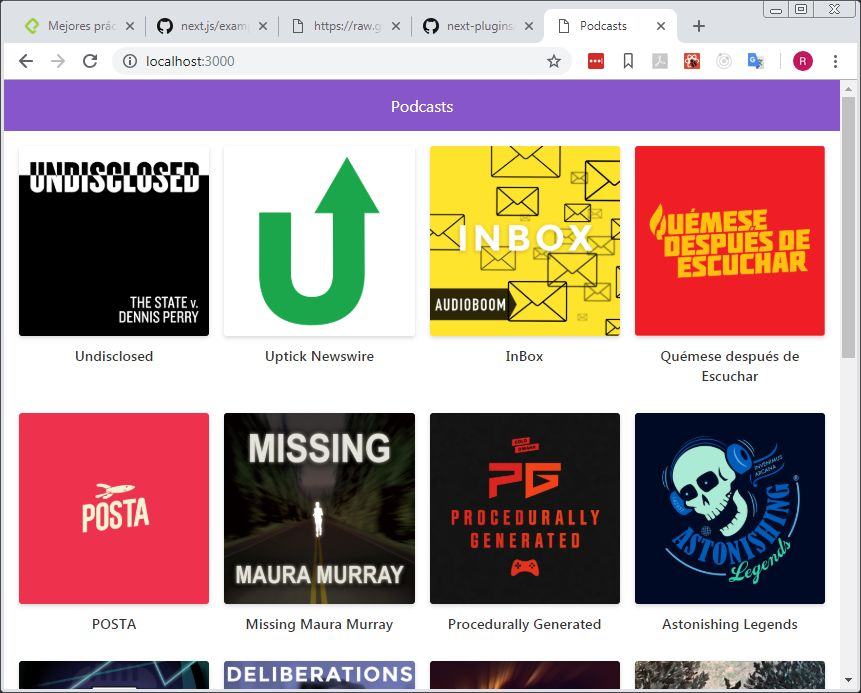

# App de podcast de Platzi 

App de Podcasts integrada con la API de Audioboom 
para aprender Next.JS

[Ver la Aplicacion] ()

## ¿Como funciona?

Requiere Node.js

* `npm install` para instalar las dependencias
* `npm run dev` para el entorno de desarrollo
* `npm run build && npm start ` para el entorno de produccion

## Licencia
MIT
